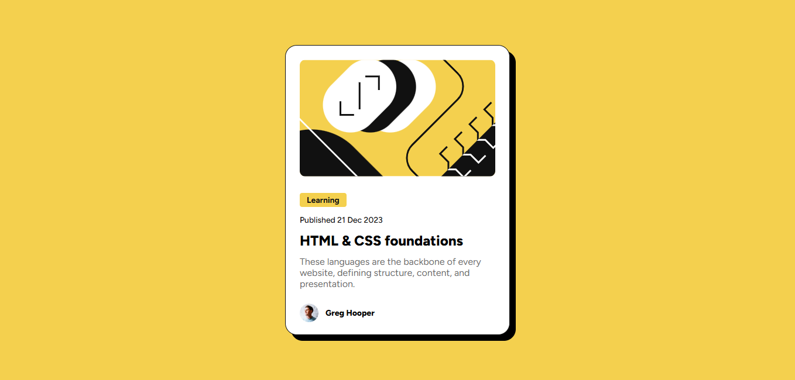
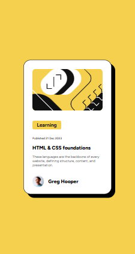

# Frontend Mentor - Blog Preview Card solution

This is a solution to the [Blog preview card challenge on Frontend Mentor](https://www.frontendmentor.io/challenges/blog-preview-card-ckPaj01IcS). Frontend Mentor challenges help you improve your coding skills by building realistic projects. 

## Table of contents

  - [Overview](#overview)
  - [Screenshot](#screenshot)
  - [Links](#links)
  - [Built with](#built-with)
  - [What I learned](#what-i-learned)
  - [Author](#author)
  - [Acknowledgments](#acknowledgments)

## Overview

### The Challenge
Users should be able to:

- See hover and focus states for all interactive elements on the page

### Screenshot

### Links

- Solution URL: [GitHub Repo](https://github.com/Chantal-Yvonne/blog-preview-card)
- Live Site URL: [Add live site URL here]( https://chantal-yvonne.github.io/blog-preview-card/)

### Built with

- Semantic HTML5 markup
- CSS custom properties
- Flexbox
- media query for at mobile 375px

### What I learned
- How to follow  design system(colors, fonts,spacing) using  style guide.
- How to center element vertically nd horizontally using flexbox.
- How to use responive deign techniques
- How to deploy  project using Github Pages.

### Continued development
- I want to strenghten my knowledge on responsive deign techniques.

## Author

- Frontend Mentor - [@Chantal-Yvonne](https://www.frontendmentor.io/profile/Chantal-Yvonne)

## Acknowledgments

This project was built based on a design brief provided by [Frontend Mentor](https://www.frontendmentor.io/).
Thanks to the Frontend Mentor community for creating helpful challenges that support practical learning and real-world development skills

